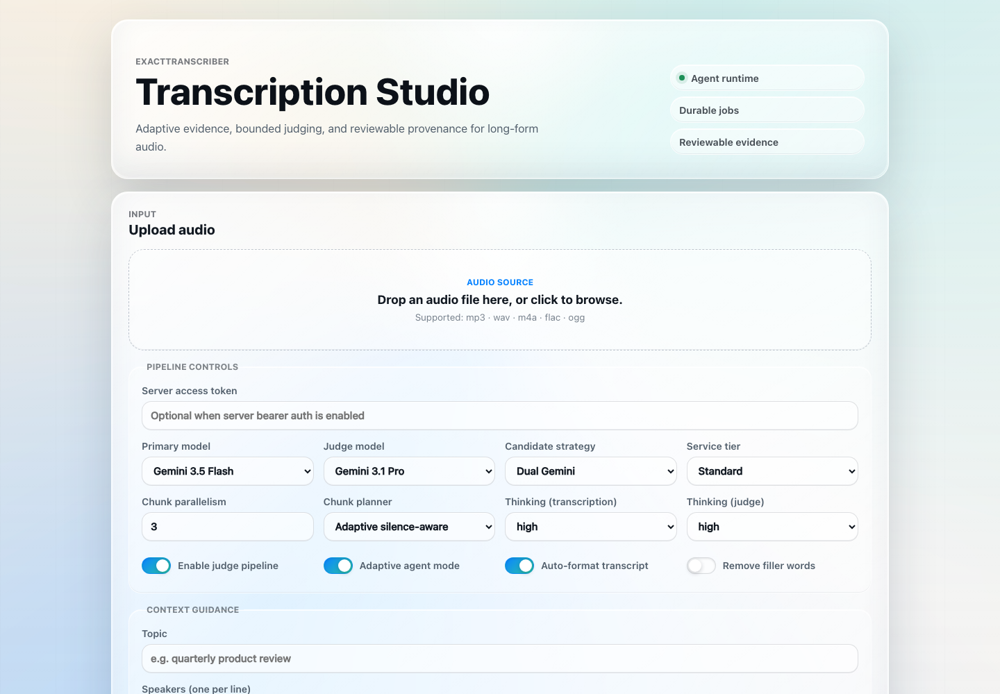

<div align="center">

# Transcription Agent

**Audio transcription in Go with Gemini, Meta, and Microsoft, durable jobs, and optional Gemini review agents.**

[](https://github.com/cyanxxy/transcription-agent-go/actions/workflows/ci.yml)
[](https://github.com/cyanxxy/transcription-agent-go/releases/latest)
[](go.mod)
[](https://pkg.go.dev/github.com/cyanxxy/transcription-agent-go)
[](LICENSE)

</div>

Transcription Agent turns audio into clean, speaker-labeled, timestamped
transcripts. By default, **Gemini 3.5 Transcribe** converts audio directly into
speaker-labeled, timestamped text. Each chunk needs one transcription request;
there are no judge calls, extra candidates, skill routing, or global reviews.
Long recordings are split at silence boundaries and transcribed concurrently.
The HTTP service persists accepted jobs and SSE events across restarts.

**Meta Muse Voice Transcribe** and **Microsoft MAI-Transcribe-2** are also
available in the model menu and CLI. Both use direct transcription with native
speaker labels and timestamps, without a judge. General-purpose Gemini models
remain available with the optional evidence and judge pipeline described below.

<p align="center">
  
</p>

```
[00:00:00] Alice: Thanks everyone for joining the quarterly review.
[00:00:06] Bob:   Happy to be here — let's start with the numbers.
```

---

## Contents

- [Features](#features)
- [Quickstart](#quickstart)
- [Architecture](#architecture)
- [HTTP API](#http-api)
- [Configuration](#configuration)
- [Meta and Microsoft transcription](#meta-and-microsoft-transcription)
- [CLI](#cli)
- [Agent Skills](#agent-skills)
- [Production safeguards](#production-safeguards)
- [Docker](#docker)
- [Deployment checklist](#deployment-checklist)
- [Testing](#testing)
- [Project layout](#project-layout)
- [License](#license)

## Features

- **Direct speech transcription by default.** Gemini 3.5 Transcribe supplies
  word timestamps and speaker labels; the app assembles utterances and exports
  TXT, SRT, or JSON. Its UI shows only relevant transcription settings.
- **Three speech providers.** Choose Gemini Transcribe, Meta Muse Voice
  Transcribe, or Microsoft MAI-Transcribe-2. Provider credentials stay on the
  server; each direct model bypasses judging and agent loops.

The evidence, judge, and skill features apply to general-purpose Gemini models.
The web UI, durable jobs, chunking, and exports support all providers.

- **Adaptive evidence loop.** Candidate strategies are ceilings, not eager
  fan-out plans. Deterministic evaluators decide when to run independent
  evidence candidates, within hard run budgets.
- **Auditable span provenance.** `agent_run` records fixed span bounds, unique
  candidate attempts, legal state transitions, judge method, selected sources,
  disputed spans, token/tool usage, and human-review requirements.
- **Structured output.** Transcripts and judge decisions are requested as
  JSON-schema-constrained Gemini output and validated before use.
- **Agent Skills.** Drop-in [`SKILL.md`](https://agentskills.io) packs tune the
  pipeline per domain (medical, legal, meeting, …), strategy, and judge — with
  deterministic *and* model-driven selection. See [Agent Skills](#agent-skills).
- **Timestamp-aware.** `[HH:MM:SS]` timestamps throughout, optional Parakeet
  forced-alignment, and SRT/TXT/JSON export.
- **Read-only global review.** An Interactions agent can pass the run, require a
  person, or request one bounded span rejudge. It cannot return transcript text.
- **Adaptive chunking.** Long audio is split on detected silence with a bounded
  chunk count. Agentic spans execute deterministically for reproducible context
  and budget allocation.
- **Interactions end to end.** A lean Go REST client uses Files API audio URIs
  with Gemini Interactions for transcription, judging, skill routing, and
  global review. It preserves typed steps and exact function-call IDs, with
  retries, back-off + jitter, and `Retry-After` handling.
- **Two front-ends.** A streaming HTTP server (Server-Sent Events) with a small
  web UI, and a single-binary CLI.
- **Durable job execution.** Disk-staged uploads, fixed workers, bounded queue,
  idempotency keys, restart recovery, resumable SSE, cancellation, and human
  review transitions.
- **Race-safe control plane.** A legal job-state machine linearizes start,
  cancellation, completion, review, expiry, and shutdown recovery. Terminal
  review-expiry events remain replayable before retention cleanup.
- **Minimal footprint.** Standard library + `go.yaml.in/yaml/v3`; an external
  `ffmpeg`/`ffprobe` for audio inspection.

## Quickstart

**Requirements:** Go 1.26+, `ffmpeg` & `ffprobe` on `$PATH`, and credentials for your selected transcription provider.

```bash
git clone https://github.com/cyanxxy/transcription-agent-go.git
cd transcription-agent-go
make build                       # -> bin/transcription-server, bin/transcriber-cli

export GEMINI_API_KEY=...

# Run the streaming web service, then open http://localhost:8080
./bin/transcription-server --addr :8080

# …or transcribe a file one-shot from the CLI
./bin/transcriber-cli --api-key "$GEMINI_API_KEY" -i meeting.m4a -format srt -o meeting.srt
```

> Supported input formats: `mp3`, `wav`, `m4a`, `flac`, `ogg`.

### Credentials

Set credentials for the providers you want to use in the server environment:

| Provider | Required configuration |
|---|---|
| Gemini | `GEMINI_API_KEY` (or `--api-key`) |
| Meta | `META_API_KEY` |
| Microsoft | `AZURE_SPEECH_KEY` and `AZURE_SPEECH_ENDPOINT` |

Provider keys are never entered into the web UI. The UI's **Server access
token** field is only for the optional bearer token configured through
`API_AUTH_TOKEN` or `--auth-token`; it authenticates to this app, not a model
provider. Restart the server after changing its environment. See
[Meta and Microsoft transcription](#meta-and-microsoft-transcription) for setup
and provider-specific limits. If you configure only Meta or Microsoft, select
that model explicitly; the default remains Gemini 3.5 Transcribe.

## Architecture

Direct path: upload → chunk if needed → selected speech provider → merge → export.
Gemini 3.5 Transcribe is the default; Meta and Microsoft use the same direct path.
Their audio is converted to WAV and uploaded directly to the selected provider.
The following architecture applies when selecting a general-purpose model.

```text
durable job + context
  -> deterministic audio spans + hard run budget
  -> primary transcription tool
  -> local evaluator
  -> optional independent evidence candidate
  -> bounded Interactions judge per span
  -> provisional merge
  -> read-only global review router
  -> optional one-time span rejudge / human review
  -> timestamp-only alignment + conservative cleanup
  -> TranscriptResult + AgentRun provenance
```

1. **Plan spans and budgets** — fixed audio bounds, allowed candidate tools,
   judge/tool/interaction limits, and one global-review allowance.
2. **Act and observe** — run the primary candidate, evaluate relative
   timestamps and transcript-side diagnostics, then admit optional evidence.
3. **Judge each span** — a stateless (`store=false`) Gemini Interactions loop
   may call transcript-analysis tools before returning a structured decision.
4. **Review globally** — a read-only tool loop returns `pass`,
   `review_required`, or validated span IDs for one rejudge.
5. **Finalize safely** — optional timestamp-only Parakeet alignment,
   conservative cleanup, provenance, quality metrics, and export.

## HTTP API

| Method & path             | Description                                            |
|---------------------------|--------------------------------------------------------|
| `GET /`                   | Web UI (upload form + live progress)                   |
| `POST /api/jobs`          | Start a transcription job → `{ "job_id": "…" }` (202)  |
| `GET /api/jobs/{id}`      | JSON snapshot of a job's events                        |
| `GET /api/jobs/{id}/stream` | Resumable SSE lifecycle, result, review, cancellation, expiry, and error events |
| `POST /api/jobs/{id}/cancel` | Idempotently request cancellation                    |
| `POST /api/jobs/{id}/review` | Accept or reject a job awaiting human review         |
| `GET /skills`             | Loaded skill metadata (JSON)                           |
| `GET /healthz`            | Liveness — always `200` while the process is up        |
| `GET /readyz`             | Readiness — `503` once graceful shutdown begins        |

`POST /api/jobs` accepts `Idempotency-Key`; retries with the same key return the
original job. SSE events have monotonic IDs and resume from `Last-Event-ID` or
`?after=N`. The web UI supports bearer auth, cancellation, review actions, and
transcript, SRT, and JSON tabs. General-purpose Gemini runs also expose
evidence, judge, and quality tabs.
Human-review responses include a deadline; expiration emits a terminal
`expired` event that remains available for one retention window.
Long files use the adaptive
silence-aware chunk planner by default; the JSON result includes the actual
chunk plan (`metadata.chunks`) with boundary type and confidence.

To select a provider programmatically, send its model ID with the audio:

```bash
curl --fail-with-body http://localhost:8080/api/jobs \
  -F 'audio=@meeting.m4a' \
  -F 'model_name=muse-voice-transcribe-1.0'
```

Use `model_name=MAI-Transcribe-2` for Microsoft. If server authentication is
configured, also send `Authorization: Bearer <server-access-token>`. Provider
keys belong in the server environment, not in the request.

## Configuration

### Server flags / env vars

| Flag                 | Env                        | Default             | Purpose |
|----------------------|----------------------------|---------------------|---------|
| `--addr`             | `HTTP_ADDR`                | `:8080`             | Listen address |
| `--api-key`          | `GEMINI_API_KEY`           | — (for Gemini)      | Gemini API key |
| —                    | `META_API_KEY`             | — (for Meta)        | Meta Model API key |
| —                    | `AZURE_SPEECH_KEY`         | — (for Microsoft)   | Azure Speech resource key |
| —                    | `AZURE_SPEECH_ENDPOINT`    | — (for Microsoft)   | HTTPS Speech resource origin |
| `--auth-token`       | `API_AUTH_TOKEN`           | —                   | Optional `Bearer` token required to `POST /api/jobs` |
| `--skills-dir`       | `SKILLS_DIR`               | `.skills`           | Directory of skill packs |
| `--skill-router`     | `SKILL_ROUTER`             | `false`             | Let the model auto-select a format skill when none is given |
| `--temp-dir`         | `TRANSCRIBER_TEMP_DIR`     | OS temp             | Per-run scratch directory |
| `--parakeet-cmd`     | `TRANSCRIBER_PARAKEET_CMD` | —                   | Optional Parakeet sidecar invocation |
| `--max-upload-bytes` | `MAX_UPLOAD_BYTES`         | `209715200` (200 MiB) | Reject larger uploads |
| `--max-concurrency`  | `MAX_CONCURRENCY`          | `4`                 | Cap on simultaneous jobs |
| `--max-queued`       | `MAX_QUEUED`               | `12`                | Cap on accepted jobs waiting for a worker |
| `--agent-max-tokens` | `AGENT_MAX_TOKENS`         | `1000000`           | Hard total Gemini-token budget for each run |
| `--max-run-time`     | `MAX_RUN_TIME`             | `30m`               | Wall-clock deadline for each transcription run |
| `--job-dir`          | `JOB_DIR`                  | `./data/jobs`       | Persistent job journal and staged audio |
| `--job-ttl`          | `JOB_TTL`                  | `30m`               | Retention for completed jobs and deadline for human review |
| `--shutdown-grace`   | `SHUTDOWN_GRACE`           | `30s`               | Drain period after SIGINT/SIGTERM |
| `--version`          | —                          | —                   | Print version and exit |
| —                    | `LOG_LEVEL`                | `info`              | `debug` / `info` / `warn` / `error` |
| —                    | `LOG_FORMAT`               | `json`              | `json` or `text` |

### Models and pipeline controls

For the CLI, select models with `--model` and `--judge-model`. The HTTP API
uses `model_name` and `judge_model_name` multipart fields.

| Model ID | Provider | Pipeline | Availability |
|---|---|---|---|
| `gemini-3.5-transcribe` | Google | Direct speech; primary default | Web, CLI, API |
| `muse-voice-transcribe-1.0` | Meta | Direct speech | Web, CLI, API |
| `MAI-Transcribe-2` | Microsoft | Direct speech | Web, CLI, API |
| `gemini-3.8-flash` | Google | General-purpose transcription; judge default | Web, CLI, API |
| `gemini-3.1-flash-lite` | Google | General-purpose transcription | CLI, API; secondary candidate |

`gemini-3.1-flash-lite` remains available through the CLI/API and supplies the
secondary candidate for dual-Gemini runs. Gemini 3.5 Flash, 3.5 Flash-Lite,
and 3.6 Flash are no longer accepted. The legacy `gemini-3-flash-preview` alias
resolves to `gemini-3.8-flash`.

Gemini 3.8 Flash uses the beta Interactions endpoint and supports `low`,
`medium`, and `high` thinking levels; `minimal` is not supported.
See the [model documentation](https://ai.google.dev/gemini-api/docs/models/gemini-3.8-flash).

**Strategies** (`--strategy` in the CLI, `candidate_strategy` in the API):
`single_gemini`, `dual_gemini`, `gemini_plus_parakeet` for general-purpose
Gemini workflows. Direct models override candidate and judge settings:
Gemini Transcribe reports `single_gemini`; Meta and Microsoft report
`single_speech`. No strategy selection is needed for direct transcription.

**Service tiers** (`--service-tier` in the CLI, `service_tier` in the API):
`standard`, `flex`, `priority`.

**Thinking levels:** `low`, `medium`, `high` for Gemini 3.8 Flash.
Gemini 3.1 Flash-Lite also supports `minimal`. Direct speech models do not use
thinking, service-tier selection, skills, or judge/global-review controls.

**Gemini 3.5 Transcribe:** Uses the Interactions `v1beta` endpoint with verbatim
transcription, speaker diarization, and word timestamps. Word annotations are
grouped into timestamped utterances for transcript, SRT, and JSON export.
This model always runs directly: judge, multi-candidate, agent, skill-router,
and global-review flags are ignored. Local filler removal remains optional. Chunk duration is limited to 30 minutes (29.5 minutes with adaptive
chunking, allowing for silence-boundary adjustments). The default remains two
minutes. Transcribe requests always use Standard service; the selected service
tier and thinking level apply only when a general-purpose model is selected. Free-form prompts, previous transcript context, and
format skills are not sent to this audio-only model. Custom vocabulary and Smart
mode are not enabled because they conflict with timestamps/diarization. Speaker
labels are local to each chunk; speaker identity across chunks is not guaranteed.
See Google's [transcription guide](https://ai.google.dev/gemini-api/docs/transcribe)
and [model limitations](https://ai.google.dev/gemini-api/docs/models/gemini-3.5-transcribe)
(checked September 14, 2026).

## Meta and Microsoft transcription

Both providers run directly, with speaker labels and timestamps, without a
judge, second candidate, skill router, or global review. Gemini 3.5 Transcribe
remains the default. Select a provider in the web model menu or with CLI `--model`.

| Model | Server/CLI environment variables | API |
|---|---|---|
| Meta Muse Voice Transcribe (`muse-voice-transcribe-1.0`) | `META_API_KEY` | Meta file transcription, `/v1/asr/transcribe` |
| Microsoft MAI-Transcribe-2 (`MAI-Transcribe-2`) | `AZURE_SPEECH_KEY`, `AZURE_SPEECH_ENDPOINT` | Azure Fast Transcription with MAI enhanced mode |

For Microsoft, set the endpoint to your Speech resource origin, such as
`https://your-resource.cognitiveservices.azure.com`, without an API path or query.
The resource must support MAI-Transcribe-2. Keys are read by the server process;
restart it after setting them. They are not submitted by the browser or saved
in job forms. A Gemini key is unnecessary when using only these providers.
Missing provider configuration is rejected before a job is queued.

```bash
# After setting META_API_KEY in your environment:
./bin/transcriber-cli --model muse-voice-transcribe-1.0 -i meeting.m4a

# After setting AZURE_SPEECH_KEY and AZURE_SPEECH_ENDPOINT:
./bin/transcriber-cli --model MAI-Transcribe-2 -i meeting.m4a
```

Input audio is converted to mono 24 kHz, 16-bit WAV. Meta uses DIARIZATION mode
and returns turn-level timestamps; Microsoft requests diarization and segment
timestamps with verbatim text. Long recordings use the existing chunk pipeline.
Meta permits at most 10 minutes / 32 MiB per request: fixed chunks may be up to
600,000 ms and adaptive chunks up to 570,000 ms, allowing 30 seconds for silence
boundary adjustment. The default 120-second chunks work for both providers.
Microsoft's WAV request limit is 300 MiB. Rate limits and server errors retry
up to twice with cancellable delays. Chunk speaker labels are local to each
request; matching labels across chunks does not establish speaker identity.

Implementation references, checked September 14, 2026:
[Meta's official file transcription recipe](https://github.com/meta-models/meta-model-cookbook/tree/main/06_muse_voice/01_voice_api_fundamentals)
and [Microsoft MAI-Transcribe-2 documentation](https://learn.microsoft.com/en-us/azure/ai-services/speech-service/mai-transcribe).

## CLI

```bash
./bin/transcriber-cli \
  --api-key "$GEMINI_API_KEY" \
  -i meeting.m4a \
  --model gemini-3.5-transcribe \
  --chunk-strategy adaptive \
  --chunk-concurrency 3 \
  --format srt \
  -o meeting.srt
```

The rendered transcript goes to stdout unless `-o` is given; progress logs go to
stderr (text by default — set `LOG_FORMAT=json` for machine output).
`SIGINT`/`SIGTERM` cancel a run cleanly. Direct speech models always disable
agent mode. With a general-purpose Gemini model, agent mode is enabled by
default; `--agentic=false` selects the fixed compatibility pipeline.
`--service-tier` affects general-purpose Gemini requests only.

Use `--chunk-concurrency 1` to process chunks sequentially. `--max-run-time`
sets the wall-clock deadline for every provider (default 30 minutes).
`--agent-max-tokens` controls the Gemini token budget (default 1,000,000);
Meta and Microsoft requests do not consume that budget.

## Agent Skills

General-purpose Gemini workflows support [Agent Skills](https://agentskills.io)-style capability
packs. A skill is a directory under `.skills/` containing a `SKILL.md` (YAML
frontmatter + Markdown body) plus optional bundled resources. Skills load at
startup; transcription-specific routing lives under the manifest's `metadata`
map, so the folders stay portable to other Agent-Skills tooling.

```
.skills/
  transcribing-medical/
    SKILL.md                    # metadata.kind=format, metadata.formats=medical
    references/drug-names.md     # level-3 resource, read on demand
  dual-gemini/SKILL.md           # metadata.kind=strategy, metadata.candidate_plan=…
  transcript-judging/SKILL.md    # metadata.kind=judge,    metadata.judge_tools=…
```

Three skill kinds ship out of the box:

| Kind         | Ships | Contributes |
|--------------|-------|-------------|
| **format**   | 7 (meeting, interview, lecture, podcast, legal, medical, technical) | Domain guidance injected into transcription + judge. Selected from `expected_format`. |
| **strategy** | 3 (single / dual Gemini, Gemini + Parakeet) | The candidate plan. `@model`, `@secondary-auto`, `@parakeet` sentinels resolve against run config. |
| **judge**    | 1 (transcript-judging) | Extra judge guidance and a judge-tool allow-list. |

**Selection.** Deterministic by default (from the user's format/strategy). With
`--skill-router`, when no `expected_format` is supplied the model picks a format
skill through the Gemini Interactions API via an `activate_skill` function
tool; the choice is then injected
deterministically into every candidate and the judge, and recorded in
`judge_notes`.

**Backward compatible.** Skills are additive and nil-safe — with no `.skills/`
directory the pipeline uses its built-in guidance, strategy resolution, and full
judge-tool set. Authoring a skill is a `SKILL.md` edit (read at startup, no
recompile), and `GET /skills` lists what's loaded.

## Production safeguards

The service includes the following application-level safeguards. Production
readiness still depends on completing the deployment checklist for the target
environment.

- **Structured JSON logs** (`log/slog`) that redact any attribute whose key
  looks like an API key or authorization header. Honors `LOG_LEVEL` and
  `LOG_FORMAT`.
- **Per-request IDs** — every request gets an `X-Request-ID` (generated if
  absent, validated, echoed) that flows through the workflow and Gemini client,
  so every log line correlates.
- **Retries with exponential back-off + jitter** for transient Gemini API
  errors (408/425/429/5xx + retryable network errors), honoring a clamped
  `Retry-After`; client errors are never retried.
- **API key never leaks** — sent as a header (not a query param) and scrubbed
  from error bodies and network errors before they surface.
- **Bounded admission before multipart parsing.** Uploads stream to `0600`
  staging files; fixed workers read audio only when active. Full queues return
  `429` with `Retry-After`.
- **Durable acceptance.** `job.json` is atomically replaced, events are fsynced
  NDJSON, queued/running jobs recover after restart, and idempotency bindings
  are rebuilt from job metadata.
- **Linearized lifecycle transitions.** Start, cancellation, success, failure,
  review, expiry, and shutdown requeue operations use guarded legal transitions,
  preventing accepted cancels or review decisions from being overwritten.
- **Coordinated idempotent creation.** Concurrent retries with the same
  `Idempotency-Key` wait for the owner request to commit or fail, so a replay is
  never returned for an unaccepted job. A key identifies one logical request;
  payloads are not compared, so clients must reuse it only for exact retries.
- **Graceful shutdown** — SIGINT/SIGTERM flips `/readyz` to 503, stops new
  connections, returns interrupted work to durable `queued` state, drains HTTP,
  and waits up to `--shutdown-grace`.
- **Panic isolation** — a panic in one job is recovered and surfaced as an error
  event; it never takes down the server.
- **Security headers** — `nosniff`, `X-Frame-Options: DENY`, a tight CSP, a
  restrictive `Referrer-Policy`/`Permissions-Policy`, plus SSE keep-alives so
  proxies don't drop streams.
- **Optional bearer auth** on create, cancel, and review endpoints
  (`--auth-token`), constant-time compared. Capability URLs protect GET/SSE.
- **Sanitized error responses** — clients get a short, key-scrubbed message plus
  the request id; full detail stays in the logs.
- **Race-clean** — `go test ./... -race` is the CI gate.

## Docker

```bash
make docker
# Pass the credentials already set in your shell:
docker run --rm -p 8080:8080 -e GEMINI_API_KEY transcription-agent:dev

# Meta-only server (select Meta in the model menu):
docker run --rm -p 8080:8080 -e META_API_KEY transcription-agent:dev

# Microsoft-only server (select Microsoft in the model menu):
docker run --rm -p 8080:8080 \
  -e AZURE_SPEECH_KEY -e AZURE_SPEECH_ENDPOINT transcription-agent:dev
```

Mount `/app/data/jobs` to retain accepted jobs across container replacement.
The image is multi-stage and alpine-based, runs as an unprivileged user
(uid 10001), bundles `ffmpeg` and the `.skills/` packs, uses `tini` as PID 1 for
signal forwarding, and defines a `HEALTHCHECK` against `/healthz`.

## Deployment checklist

- [ ] **Secrets** — provide the selected providers' keys via a secret store, never baked into
      an image or echoed to logs (the logger redacts it, but treat it as
      sensitive).
- [ ] **Protect job creation** — `POST /api/jobs` spends the selected provider's quota. Front it
      with proxy auth or set `--auth-token`/`API_AUTH_TOKEN` (clients then send
      `Authorization: Bearer <token>`). With a token set, drive the API
      programmatically or enter the token in the bundled UI. With no token the
      server logs a startup warning. Job reads are gated by the
      unguessable 96-bit job id.
- [ ] **Durable volume** — mount `JOB_DIR`, define retention and backup policy,
      and monitor disk usage; audio and transcripts are sensitive data.
- [ ] **Sizing** — set `MAX_CONCURRENCY`, `MAX_QUEUED`, and `MAX_UPLOAD_BYTES`
      to match API quota and reverse-proxy limits. `JOB_TTL` is both completed-job
      retention and the human-review deadline; tune it accordingly. Expired review
      jobs remain replayable for one additional retention window before deletion.
- [ ] **TLS** — terminate at a reverse proxy (nginx, Caddy); the server speaks
      HTTP only by design.
- [ ] **Probes** — wire `/healthz` (liveness) and `/readyz` (readiness); set
      Kubernetes `terminationGracePeriodSeconds` ≥ `--shutdown-grace`.
- [ ] **Logs** — scrape JSON logs and index by `request_id` / `job_id`.
- [ ] **Parakeet** — to use `gemini_plus_parakeet`, ship the sidecar in the image
      and set `TRANSCRIBER_PARAKEET_CMD`.

## Testing

```bash
make test        # plain
make test-race   # with the race detector (the CI gate)
make cover       # coverage profile + total
make lint        # golangci-lint v2 (falls back to go vet if not installed)
```

CI (`.github/workflows/ci.yml`) runs `gofmt`, `go vet`, `golangci-lint`,
`govulncheck`, the race-enabled test suite, a build of both binaries, and a
server smoke test. The
suites cover durable recovery, admission before body parsing, idempotency,
cancellation/start races, late cancellation, concurrent review, expiry replay,
shutdown recovery, exact span provenance, legal state transitions, atomic
rejudge budgets, and shared Files API uploads. They also cover
the Gemini client (happy path, key scrubbing, 5xx retries,
`Retry-After`, finish-reason handling, the Files API flow, Interactions step
replay and function-call IDs), the adaptive candidate/judge workflow
end-to-end, chunk planning and overlap
de-duplication, timestamp parsing/alignment, quality scoring, the skills engine
(parsing, validation, selection, path-traversal rejection, the router), and the
HTTP server (health/readiness, security headers, auth gate, SSE lifecycle,
graceful-shutdown cancellation). Meta and Microsoft tests cover multipart
requests, authentication headers, model options, timestamp ordering, missing
credentials, error redaction, and cancellation during rate-limit backoff.
End-to-end tests convert short and chunked audio through mocked provider APIs
and verify chunk offsets and the absence of Gemini or judge calls. Live provider
access and transcription quality require separate tests with valid credentials.

## Project layout

| Area                        | Location                                       |
|-----------------------------|------------------------------------------------|
| Adaptive workflow runtime   | `internal/workflow/workflow.go`                |
| Meta / Microsoft adapters   | `internal/agents/speech.go`                    |
| Gemini word-to-turn parser   | `internal/agents/transcribe.go`                |
| Transcription agent         | `internal/agents/transcription.go`             |
| Judge agent (+ tools)       | `internal/agents/judge.go`, `judge_tools.go`   |
| Global review router        | `internal/agents/review.go`                    |
| Agent run / span state      | `internal/workflow/agent_run.go`               |
| Quality / editing / context | `internal/agents/{quality,editing,context}.go` |
| Parakeet alignment          | `internal/agents/timestamp.go` (sidecar)       |
| Gemini REST client          | `internal/gemini/client.go`, `interactions.go` |
| Agent Skills engine         | `internal/skills/` (packs in `.skills/`)       |
| Audio probe / chunking      | `internal/audio/audio.go` (ffmpeg CLI)         |
| Data models / validation    | `internal/models/models.go`                    |
| Config / strategies         | `internal/config/config.go`                    |
| Observability               | `internal/obs/logger.go` (slog + request IDs)  |
| HTTP + SSE front-end        | `cmd/server` (+ `cmd/server/web/`)             |
| Durable job subsystem       | `cmd/server/job_{types,store,runner}.go`       |
| CLI                         | `cmd/cli`                                       |

### Implementation notes

The Gemini integration remains a Go REST client rather than an SDK dependency.
It now handles current Interactions error diagnostics, queued status, and UTF-8
byte ranges on word annotations. Transcribe continues to use `store=false`.

The judge and tool-loop notes below apply to general-purpose Gemini workflows.

- The judge runs a **bounded Interactions tool loop** — it may call
  `quality_metrics`, `timestamp_analysis`, `candidate_diff`, and
  `boundary_analysis` before returning its structured decision. Tool turns,
  calls per turn, and total calls are capped. These tools inspect transcript
  text and metadata only; **raw audio is sent to transcription candidates,
  never to judge tools.**
- Judge function results carry the model's exact `call_id`. Ordinary tool
  failures return as `is_error` observations so the judge can recover;
  cancellation and deadlines abort immediately.
- Candidate, judge, and global-review structured output use the Interactions
  top-level `response_format` (`type: text`, `mime_type: application/json`,
  JSON Schema). Audio candidates use typed `audio` inputs referencing one
  shared Files API upload per span.
- Interactions thinking is configured through
  `generation_config.thinking_level`. Every continuation re-specifies tools,
  system instructions, and generation configuration because those settings are
  interaction-scoped.
- Interactions run statelessly (`store=false`) so transcript data is not added
  to server-side interaction history. Tool continuations replay every returned
  model step, including thought signatures, exactly as received.
- Parakeet (NeMo) runs as an optional external sidecar over stdin/stdout JSON
  (`internal/agents/timestamp.go`; reference `tools/parakeet_sidecar.py`). Without
  one, `gemini_plus_parakeet` still runs. Alignment is accepted only when the
  segment count, text, speakers, and confidence are unchanged; only validated
  timestamps can be copied onto the judged transcript. The command is parsed
  as shell-style words without invoking a shell, so quote executable paths and
  arguments containing spaces; shell expansion and pipelines are not supported.

## License

[Apache License 2.0](LICENSE).
